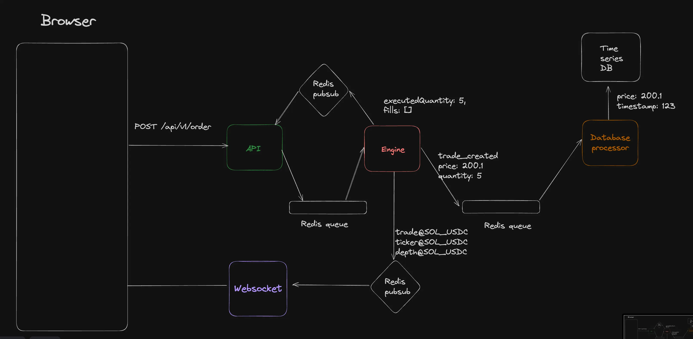

# Backend Architecture

#### This project aims to develop a real-time trading system using Next.js and Express.js. The system will provide users with a seamless and efficient platform for placing, executing, and monitoring trades.

